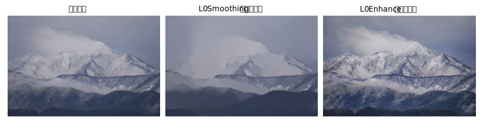
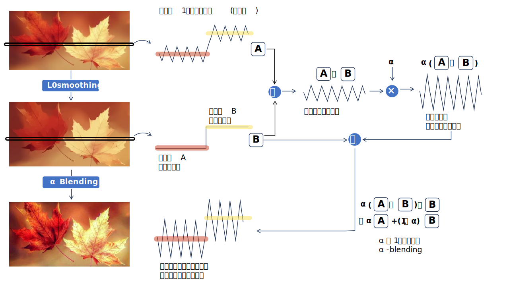

<html lang="ja">
    <head>
        <meta charset="utf-8" />
    </head>
    <body>
        <h1>
L0 Enhancement
</h1>
        <h2>なにものか？</h2>
        

            L0 Smoothingを使ってテクスチャー強調した画像を生成します。 
             
        

        <h3>処理概要</h3>
        

            L0 Smoothingを使って被写体の平均輝度を維持したままテクスチャー強調を行います。 
            <a href="https://www.cse.cuhk.edu.hk/~leojia/papers/L0smooth_Siggraph_Asia2011.pdf">Image Smoothing via L0 Gradient Minimization</a> 
             
        

        <h2>環境構築方法</h2>
        

            <a href="https://github.com/nrupatunga/L0-Smoothing/">https://github.com/nrupatunga/L0-Smoothing/</a> 
            Code → Download ZIP 
            L0-Smoothing-master.zip を解凍し、以下のファイルをsrcフォルダにコピーする。 
            ・L0-Smoothing-master\src\L0_Smoothing.py 
            ・L0-Smoothing-master\src\psf2otf.py 
             
            pip install opencv-python 
        

        <h2>使い方</h2>
        <h3>STEP1. 入力画像をL0 Smoothingする。</h3>
        

            python L0.py (画像ファイル名) 
             
            L0smoothed_(画像ファイル名).png に結果が保存されます。
        

        <h3>STEP2. 入力画像とL0 Smoothingされた画像をαブレンドする。</h3>
        

            python alpha_blend.py (入力画像ファイル名) (L0 Smoothingされた画像ファイル名) 
             
            矢印キー押下でα値を調整します。 
            sキー押下で blend_(入力画像ファイル名)_(L0 Smoothingされた画像ファイル名).png に結果が保存されます。 
            ESCキー押下でプログラムが終了します。
        

    </body>
